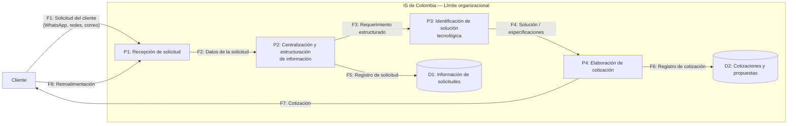

# DFD — Proceso 02: Gestión de solicitudes y cotización de clientes

## Nota de modelado

D1 y D2 son **almacenes lógicos de información**. La documentación disponible del cliente no establece que actualmente exista una base de datos o aplicación formal equivalente. Esto evita confundir el estado actual manual con una arquitectura futura aún no definida.
