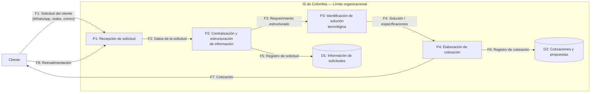

# Informe Técnico del Taller

##  Nombre del Taller
**Taller 5 - Evaluación de Seguridad con STRIDE aplicada a IS de Colombia (ISD Colombia)**

##  Integrantes del equipo
- Juan Esteban Ocampo
- Simón Montoya
- Carlos Conde

##  Descripción general del trabajo

El presente informe documenta la aplicación del marco **STRIDE** al cliente real **IS de Colombia (ISD Colombia)**, dentro del curso de Arquitectura Empresarial de la Universidad de La Sabana.

El análisis se realizó sobre el **Proceso 02 — Gestión de solicitudes y cotización de clientes**, seleccionado por su relevancia dentro de la transformación esperada de la organización. La documentación del cliente indica que las solicitudes se reciben actualmente mediante canales informales como WhatsApp, redes sociales y correo, sin CRM ni plataforma formal; posteriormente, el equipo centraliza y estructura la información para identificar una solución tecnológica y elaborar la cotización correspondiente.

La metodología aplicada fue la definida en la guía del Taller 5: **1) seleccionar el flujo y construir un DFD, 2) identificar elementos, 3) aplicar las seis categorías STRIDE, 4) evaluar impacto y proponer mitigaciones y 5) priorizar por riesgo**. La guía advierte además que las amenazas deben formularse sobre elementos concretos del DFD y que los controles existentes del cliente deben basarse en evidencia y no en suposiciones.

**Fuente primaria:** Ficha de Caracterización del Cliente de IS de Colombia, validada mediante entrevista con la cliente y fechada el 16/08/2026.

##  Proceso de desarrollo

### 1. Selección del flujo crítico

Se seleccionó el **Proceso 02 — Gestión de solicitudes y cotización de clientes**. La ficha del cliente lo describe como el proceso de recepción de solicitudes de clientes y elaboración de cotizaciones, con la expectativa de contar con un canal estructurado que permita centralizar los pedidos y, cuando exista información suficiente, automatizar la generación de cotizaciones.

### 2. Modelado DFD

Se construyó un DFD lógico a partir del diagrama de procesos entregado. Como la organización se encuentra en una situación actual predominantemente manual, los almacenes de datos del DFD representan **activos lógicos de información** y no implican que exista actualmente una base de datos o aplicación formal.

### 3. Elementos identificados

| ID | Elemento | Tipo | Descripción |
|---|---|---|---|
| E1 | Cliente | Actor externo | Solicita la solución/cotización y entrega los requerimientos. |
| P1 | Recepción de solicitud | Proceso | Recibe la solicitud por los canales utilizados actualmente. |
| P2 | Centralización y estructuración | Proceso | Organiza y estructura la información recibida. |
| P3 | Identificación de solución tecnológica | Proceso | Busca/identifica la alternativa adecuada al requerimiento. |
| P4 | Elaboración de cotización | Proceso | Prepara la propuesta comercial y la envía al cliente. |
| D1 | Información de solicitudes | Almacén lógico | Requerimientos, datos de contacto y documentación asociada. |
| D2 | Cotizaciones y propuestas | Almacén lógico | Propuestas comerciales, precios y condiciones. |
| F1–F8 | Flujos de información | Flujo | Transferencias entre cliente, procesos y activos de información. |

##  Análisis del modelo propuesto

### Contexto del cliente

IS de Colombia se dedica a la comercialización y suministro de tecnología, incluyendo equipos de cómputo, impresoras, servidores y soluciones de seguridad electrónica. La organización cuenta con cinco empleados y actualmente tiene una operación con un alto componente manual en los procesos estudiados.

La ficha de caracterización identifica como problemas principales: la búsqueda manual de equipos que cumplan especificaciones técnicas exigentes, la inexistencia de una plataforma formal para recibir y centralizar solicitudes y la elaboración manual de información técnica para instalaciones. Para el alcance de este taller, el foco se mantiene en la gestión de solicitudes y cotización.

### Necesidades que representa el modelo

El DFD representa las necesidades de transformación descritas por la organización:

1. **Formalizar el ingreso de solicitudes.**
2. **Centralizar y estructurar la información del cliente.**
3. **Reducir errores de transcripción y pérdida de contexto.**
4. **Controlar el acceso a información comercial y de clientes.**
5. **Aumentar la trazabilidad de solicitudes y cotizaciones.**
6. **Preparar la arquitectura para automatizar parcialmente la elaboración de cotizaciones.**

### Supuestos y límites

- La documentación entregada no define todavía una arquitectura tecnológica definitiva para la solución futura.
- No se presume la existencia de un CRM, base de datos, API, servidor o mecanismo específico de autenticación en el estado actual.
- Cuando un control de seguridad no está documentado, se registra como **"No documentado durante el levantamiento / Pendiente de validación"**.
- Los almacenes D1 y D2 son representaciones lógicas del activo de información; no deben interpretarse como componentes tecnológicos actualmente instalados.
- El análisis no realizó pruebas activas contra ISD Colombia.

##  Aplicación de STRIDE

La guía del taller define las seis categorías: **Spoofing, Tampering, Repudiation, Information Disclosure, Denial of Service y Elevation of Privilege**. El análisis se aplicó sobre los elementos relevantes del DFD y se evitó formular amenazas genéricas.

### Principales amenazas identificadas

| ID | STRIDE | Activo | Resumen |
|---|---|---|---|
| T01 | Spoofing | P1/F1 | Suplantación del cliente al enviar una solicitud. |
| T02 | Tampering | P1/P2/F1-F2 | Alteración del requerimiento durante la recepción/estructuración. |
| T03 | Repudiation | P2/D1 | Falta de trazabilidad para demostrar qué se solicitó o modificó. |
| T04 | Information Disclosure | D1 | Acceso no autorizado a solicitudes e información de clientes. |
| T05 | Denial of Service | P1 | Saturación del canal de recepción. |
| T06 | Elevation of Privilege | P2/P4 | Usuario con privilegios superiores a los necesarios. |
| T07 | Tampering | P2/P3/F3 | Modificación del requerimiento técnico antes de seleccionar la solución. |
| T08 | Information Disclosure | D2 | Exposición de cotizaciones, precios y condiciones comerciales. |
| T09 | Repudiation | P4/D2 | Falta de evidencia sobre creación o modificación de cotizaciones. |
| T10 | Spoofing | F7 | Suplantación de ISD al enviar una cotización falsa. |
| T11 | Information Disclosure | F1 | Exposición accidental por uso de canales informales. |
| T12 | Elevation of Privilege | P2/P4 | Acceso a privilegios administrativos no necesarios. |

El detalle completo, con escenario de ataque, impacto, probabilidad, riesgo, controles actuales, mitigación, responsable y estado, se encuentra en `tabla-stride-cliente.xlsx`.

##  Evaluación y priorización de riesgos

### Escala utilizada

Como la guía del taller solicita combinar impacto y probabilidad, pero no define una escala numérica obligatoria en la documentación consultada, se utilizó una matriz 1–5:

- **Impacto:** Medio = 3, Alto = 5.
- **Probabilidad:** Baja = 1, Media = 3, Alta = 5.
- **Puntaje = Impacto × Probabilidad.**
- **Crítico:** 17–25; **Alto:** 10–16; **Medio:** 5–9; **Bajo:** 1–4.

### Hallazgos de mayor prioridad

1. **T02 — Tampering del requerimiento:** el proceso actual incorpora estructuración manual, por lo que la integridad del requerimiento es crítica para que la solución y la cotización respondan a la necesidad real.
2. **T04 — Information Disclosure de solicitudes:** el activo contiene información de clientes y requerimientos y actualmente no existe una plataforma formal documentada.
3. **T06 — Elevation of Privilege:** en una solución futura, los roles comerciales deben separar recepción, análisis, cotización y administración.
4. **T07 — Tampering de especificaciones:** una modificación del requerimiento puede provocar incumplimiento de especificaciones técnicas.
5. **T08 — Information Disclosure de cotizaciones:** precios y condiciones comerciales deben considerarse activos confidenciales.
6. **T11 — Information Disclosure por canales informales:** es un riesgo directamente asociado al estado actual documentado por el cliente.
7. **T12 — Elevation of Privilege:** la futura plataforma debe garantizar mínimo privilegio y separar cuentas privilegiadas.

##  Controles y mitigaciones propuestas

Las mitigaciones deben traducirse posteriormente en requisitos de arquitectura. Las principales son:

- **Autenticación y MFA** para usuarios y cuentas privilegiadas.
- **RBAC y mínimo privilegio** para separar funciones.
- **HTTPS/TLS** para proteger comunicaciones de la solución futura.
- **Cifrado en reposo** para activos de información sensibles.
- **Logs de auditoría** con usuario, fecha, hora, origen y acción realizada.
- **Control de versiones** para solicitudes y cotizaciones.
- **Validación de integridad** de datos estructurados.
- **Rate limiting y anti-spam** para el canal de recepción.
- **Centralización de la información** en una plataforma empresarial con acceso controlado.
- **Protección de dispositivos y cuentas** utilizados para acceder al sistema.

Estas recomendaciones son coherentes con buenas prácticas de seguridad de aplicaciones y gestión del riesgo. NIST CSF 2.0 proporciona un marco general para que organizaciones de cualquier tamaño gestionen, prioricen y comuniquen sus riesgos de ciberseguridad. OWASP ASVS sirve como base para verificar controles técnicos de aplicaciones, mientras que OWASP API Security Top 10 es especialmente relevante si la solución futura expone APIs para el portal, automatización o integraciones con servicios externos.

##  Relación con Arquitectura Empresarial

Las mitigaciones de STRIDE pueden transformarse en **requisitos de arquitectura**. Por ejemplo:

| Amenaza | Mitigación | Requisito de arquitectura |
|---|---|---|
| T01 Spoofing | Identificación/autenticación | El sistema deberá autenticar a los usuarios y verificar solicitudes sensibles antes de procesarlas. |
| T02/T07 Tampering | Integridad + control de versiones | El sistema deberá conservar el requerimiento original y registrar todas las modificaciones. |
| T03/T09 Repudiation | Auditoría | El sistema deberá registrar usuario, fecha, hora y acción para operaciones relevantes. |
| T04/T08/T11 Information Disclosure | RBAC + cifrado | El sistema deberá limitar el acceso por rol y proteger datos sensibles en tránsito y reposo. |
| T05 DoS | Rate limiting | El canal formal deberá limitar solicitudes abusivas y monitorear volúmenes anómalos. |
| T06/T12 Elevation of Privilege | RBAC + mínimo privilegio | El sistema deberá aplicar autorización en servidor y separar funciones administrativas. |

La propia guía STRIDE del taller propone modelar estas mitigaciones en ArchiMate como elementos `Requirement` relacionados mediante `Influence` con componentes de Aplicación o Tecnología.

##  Práctica OWASP Juice Shop

La guía del taller solicita completar al menos un reto práctico de OWASP Juice Shop y relacionarlo con una fila STRIDE. Juice Shop es una aplicación deliberadamente vulnerable desarrollada para entrenamiento de seguridad.

**Estado en esta entrega: pendiente de ejecución/evidencia.** No se afirma haber ejecutado el reto porque no se dispone de una evidencia suministrada por el equipo de esta sesión.

Para cumplir el requisito práctico, se recomienda ejecutar localmente Juice Shop con Docker y completar uno de los retos definidos por la guía del taller. El reto de **panel de administración (Elevation of Privilege)** es el que mejor se relaciona conceptualmente con **T06/T12**; también puede utilizarse el reto de manipulación de precio para relacionarlo con **T02/T07 (Tampering)**.

Las pruebas activas deben permanecer exclusivamente dentro del entorno autorizado de Juice Shop y **no deben repetirse contra ISD Colombia**.

##  Reconocimiento pasivo del cliente real

El taller exige que los controles existentes del cliente real se basen en evidencia observable y no en suposiciones. En esta entrega se declara expresamente que los controles técnicos actuales que no están documentados permanecen como **pendientes de validación**.

Para una segunda iteración, y solamente si existe autorización para observación pública, pueden revisarse:

- Cabeceras de seguridad HTTP de un sitio público del cliente, si existe.
- Configuración TLS/certificado de servicios públicos.
- Mensajes de error expuestos públicamente.
- Documentación de API pública, si está publicada sin autenticación.
- Exposición histórica de datos vinculada a dominios corporativos mediante fuentes permitidas.

No se realizaron pruebas de explotación ni intentos de acceso no autorizado sobre los sistemas de ISD Colombia.

##  Diferencias frente al caso base EdukIT

El caso EdukIT está orientado a educación virtual y maneja cuentas de estudiantes, docentes, calificaciones, contenidos y pagos. ISD Colombia, en cambio, se encuentra en el sector de comercialización y suministro de tecnología y centra su transformación en recepción de solicitudes, identificación de soluciones y elaboración de cotizaciones.

Por esto, en ISD Colombia destacan especialmente:

- La **confidencialidad de requerimientos y cotizaciones**.
- La **integridad de especificaciones técnicas y precios**.
- La **trazabilidad de decisiones comerciales**.
- La **separación de funciones internas**.
- La necesidad de sustituir progresivamente canales informales por un canal empresarial estructurado.

## Conclusiones

El análisis STRIDE muestra que el principal reto de seguridad de ISD Colombia no se limita a vulnerabilidades técnicas tradicionales. El riesgo está fuertemente relacionado con la **informalidad actual del manejo de solicitudes, la centralización manual de información y la ausencia de controles tecnológicos documentados**.

Los riesgos de mayor prioridad se concentran en la integridad y confidencialidad de solicitudes y cotizaciones, además del control de privilegios en una futura plataforma. La mitigación recomendada debe incorporarse desde el diseño de la solución y no después de su implementación.

El análisis también permite conectar directamente seguridad y arquitectura empresarial: cada mitigación STRIDE puede convertirse en un requisito de arquitectura que oriente la selección de componentes, controles de acceso, mecanismos de auditoría, protección de datos y disponibilidad.

Finalmente, la priorización obtenida debe considerarse **preliminar** hasta que la empresa valide los controles actuales y se defina la arquitectura tecnológica concreta de la solución futura.

---

##  Referencias

1. National Institute of Standards and Technology. (2024). *The NIST Cybersecurity Framework (CSF) 2.0*. https://www.nist.gov/publications/nist-cybersecurity-framework-csf-20
2. OWASP Foundation. (2026). *OWASP Application Security Verification Standard (ASVS)*. https://owasp.org/www-project-application-security-verification-standard/
3. OWASP Foundation. (2023). *OWASP API Security Top 10*. https://api-security.owasp.org/
4. OWASP Foundation. (2026). *OWASP Juice Shop*. https://owasp.org/www-project-juice-shop/
5. AREM-Taller_5_Seguridad. (2026). *Guía Paso a Paso: Evaluación de Seguridad con STRIDE*. https://github.com/CesarAVegaF312/AREM-Taller_5_Seguridad/blob/main/clase/guia_paso_a_paso_stride.md
6. IS de Colombia. (2026). *Ficha de Caracterización del Cliente — Arquitectura Empresarial, Fase Preliminary*. Documento suministrado por el equipo.

